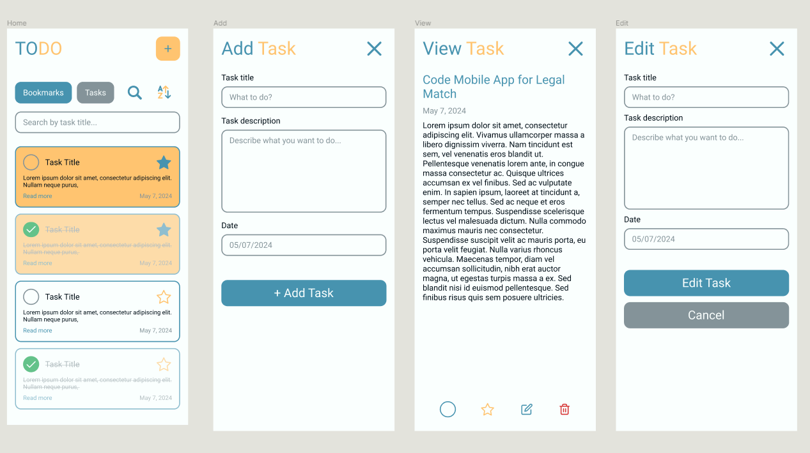
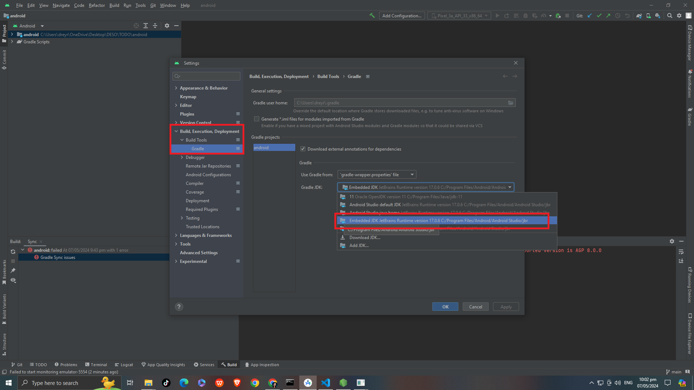

# 

This a simple task app that runs Android/IOS. It can add, edit, delete, bookmark and mark as complete tasks. This is made with React Native frameworks and uses MMKV as storage and Redux toolkit with Redux Saga as state management.

The app prototype was first made using Figma before it undergo development. This ensure smoother development process and avoid redesigning while coding.
# 
[Figma Link](https://www.figma.com/design/ACmqhQsnEFLSKprQkbxGma/TODO-App?node-id=0%3A1&t=BE12aM5NPNB9dTKF-1)

# Getting Started

>**Note**: Make sure you have completed the [React Native - Environment Setup](https://reactnative.dev/docs/environment-setup)

## Step 1: First clone this repository

```bash
git clone https://github.com/odenlerma/todo-app.git
```

## Step 2: Install dependencies
Make sure you already have nodejs & npm installed in your system.

Go to folder and run the following commands:

```bash
npm install

#for IOS
cd ios && pod install && cd ..
```

## Step 3: Run application
### For Android

```bash
react-native run-android

# OR 
npx react-native run-android
```

### For iOS

```bash
react-native run-ios
```

If everything is set up _correctly_, you should see your new app running in your _Android Emulator_ or _iOS Simulator_ shortly provided you have set up your emulator/simulator correctly.

# Troubleshooting

## Android - Upgrade to JDK 17 issue
If you have encountered JDK issue, this is the workaround steps you can use.

1. Open Android Studio and open your project android folder.
2. Go to *File > Settings > Build, Execution, Deployment > Build Tools > Gradle* and change Gradle JDK to **Embedded JDK JetBrains Runtime version 17.0.6** . 
Note the path of embedded JDK.

# 

3. Click "OK"

4. Then we need to add the following line in our project. Go to *android/gradle.properties*

```
 org.gradle.java.home={path-to-your-Embedded-JDK}
```
5. Save and rerun app

If you can't get this to work, see the [Troubleshooting](https://reactnative.dev/docs/troubleshooting) page.

# Deployment

## Android - Google Playstore
Follow the following steps for Publishing to Google Playstore

### Step 1: Generate an upload key
First we need to generate upload key and copy it to our project *android/app* directory. Follow the steps below on how to generate upload key.

**For Windows**

Open terminal and go to your jdk directory (eg. C:\Program Files\Java\jdkx.x.x_x\bin) and run the keytool below. Ensure replace *my-upload-key* and *my-key-alias* variable from keytool snippet

```bash
keytool -genkeypair -v -storetype PKCS12 -keystore my-upload-key.keystore -alias my-key-alias -keyalg RSA -keysize 2048 -validity 10000
```

**For macOS**

Open terminal and locate JDK bin folder by running
```bash
/usr/libexec/java_home
```

Go to the the output JDK location and run keytool command. Ensure replace *my-upload-key* and *my-key-alias* variable from keytool snippet
```bash
sudo keytool -genkey -v -keystore my-upload-key.keystore -alias my-key-alias -keyalg RSA -keysize 2048 -validity 10000
```
### Step 2: Set up Gradle variables
1. Place the my-upload-key.keystore file under the android/app directory in your project folder.
2. Edit the file ~/.gradle/gradle.properties or android/gradle.properties, and edit the following (replace ***** with the correct keystore password, alias and key password)

```
#keystore
STORE_FILE=my-upload-key.keystore
KEY_ALIAS=my-key-alias
STORE_PASSWORD=******
KEY_PASSWORD=*****
```
3. Save changes.

### Step 3: Generate AAB
Run the following command:
```bash
npx react-native build-android --mode=release
```
The generated file should be located inside *android/app/build/outputs/bundle*. This will be file you need to upload to Google Playstore console.

>> Notes: If you are to build for an update for an exisiting playstore app, remember to change *versionCode* and *versionName* from *android/app/build.gradle*

### Testing release build of app
Run the following command to see release build of app
```bash
npm run android -- --mode="release"
```

Click [here](https://reactnative.dev/docs/signed-apk-android) ror additional and more detailed steps

## iOS - Apple App Store
Follow the following steps for Publishing to Apple App Store

### Build app for release
1. Open .xcworkspace of you project in XCode.
2. Setup signing configurations. You will need an Apple Developer account here. Click [here](https://developer.apple.com/documentation/xcode/distributing-your-app-to-registered-devices) for additional guides.
3. Click *Product > Archive* . Make sure to set the device to "Any iOS Device (arm64)".
4. After the archive is completed, in the archive window, click on Distribute App.
5. Click on App Store Connect now (if you want to publish in App Store).
6. Click Upload → Make sure all the check boxes are selected, hit Next.
7. Choose between Automatically manage signing and Manually manage signing based on your needs.
8. Click on Upload.
9. Now you can find it in the App Store Connect under TestFlight.

Now fill up the necessary information and in the Build Section, select the build of the app and click on Save → Submit For Review.

Click [here](https://reactnative.dev/docs/publishing-to-app-store) ror additional and more detailed steps

# Dependencies

## React Native MMKV
Repo: [Link](https://github.com/mrousavy/react-native-mmkv)
This was used as storage for the tasks. This was used due to because it is deemed to faster than AsyncStorage for local storage of data.

Supporting Articles: [Link1](https://blog.logrocket.com/using-react-native-mmkv-improve-app-performance/) [Link2](https://medium.com/@barisberkemalkoc/react-native-mmkv-library-fcc11a0b7628)


## Redux Toolkit
Website: [Link](https://redux-toolkit.js.org/)

This was used because it simplifies state management, reduces Redux boilerplate,  supports async logic, and is officially supported by the Redux team. Since *createStore* was depreciated in Redux and it was suggested to use this instead.

## Redux Saga
Website: [Link](https://redux-saga.js.org/)

This was used because it will provide a middleware solution for managing side effects, such as asynchronous operations, in Redux applications.

## React Native Animatable
Repo: [Link](https://github.com/oblador/react-native-animatable)

This was used for a ready-made and easy to use animation.

## React Native Date Picker
Repo: [Link](https://github.com/henninghall/react-native-date-picker)

This was used for modal type picker for date.

## React Native Modal
Repo: [Link](https://github.com/react-native-modal/react-native-modal)

This was used for root modal type and is more easier to use than build in modal of React Native

## React SVG and React Native Lottie
Repo: [SVG](https://github.com/software-mansion/react-native-svg) [Lottie](https://github.com/lottie-react-native/lottie-react-native)

This was used for customized icons within the app to match app aesthetics.

## React Navigation
Website: [Link](https://reactnavigation.org/)

This was used for routing screens and passing parameters from one screen to another

# Contributing
Looking to contribute something to Minimal? [Here's how you can help](/Contributing.md).


# License:
The MIT License (MIT)

Copyright (c) 2024 odenlerma

Permission is hereby granted, free of charge, to any person obtaining a copy
of this software and associated documentation files (the "Software"), to deal
in the Software without restriction, including without limitation the rights
to use, copy, modify, merge, publish, distribute, sublicense, and/or sell
copies of the Software, and to permit persons to whom the Software is
furnished to do so, subject to the following conditions:

The above copyright notice and this permission notice shall be included in all
copies or substantial portions of the Software.

THE SOFTWARE IS PROVIDED "AS IS", WITHOUT WARRANTY OF ANY KIND, EXPRESS OR
IMPLIED, INCLUDING BUT NOT LIMITED TO THE WARRANTIES OF MERCHANTABILITY,
FITNESS FOR A PARTICULAR PURPOSE AND NONINFRINGEMENT. IN NO EVENT SHALL THE
AUTHORS OR COPYRIGHT HOLDERS BE LIABLE FOR ANY CLAIM, DAMAGES OR OTHER
LIABILITY, WHETHER IN AN ACTION OF CONTRACT, TORT OR OTHERWISE, ARISING FROM,
OUT OF OR IN CONNECTION WITH THE SOFTWARE OR THE USE OR OTHER DEALINGS IN THE
SOFTWARE.